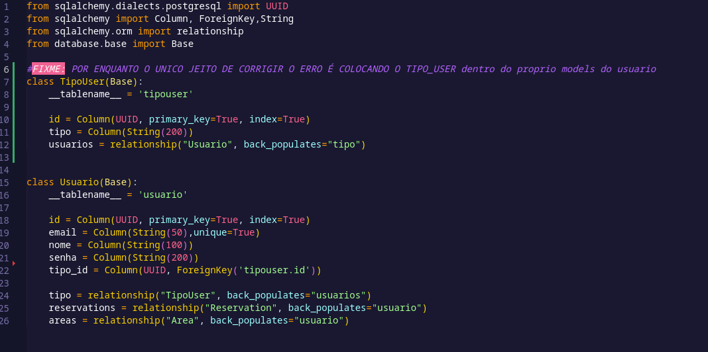

# Para subir a imagem do banco com o docker(puramente):

```
docker run -d -p 5439:5432 -e POSTGRES_USER=postgres -e POSTGRES_PASSWORD=postgres -e POSTGRES_DB=postgres postgres:latest
```

# Para aplicar as migrações ja feitas no alembic:

```
  alembic upgrade head
```

# para qualquer alteração dos modelos de Usuario/Reserva/Area é necessario criar uma nova migração no alembic:

```
  alembic revision --autogenerate -m "descrição_significativa"
```

- Gera automaticamente uma nova revisão/migração baseada nas diferenças detectadas entre o estado atual do banco de dados e os modelos declarativos(model).


# Para iniciar o servidor

```
uvicorn app.main:app --reload  
```

- link do servidor: http://127.0.0.1:8000/

# Etapas para testar rotas usando o swegger do FastApi:

1. Garanta que o servidor esteja rodando:

   - Entre no link: http://127.0.0.1:8000/docs:

   1. [Para testar as rotas de Usuario](app/usuario/usuario.md)
   
   2. [Para testar as rotas de Area](app\area\area.md)
   
   3. [Para testar as rotas de Reserva](app\reserva\reserva.md)
   
<div style="color:red; padding:10px; border-radius: 5px;">
  <strong>OBS:</strong> usuário ainda precisa ser definido como adm ou cliente. No momento, o usuário do teste é adm e cliente. Talvez precisaremos de conexão com a autenticação do ufpe id ou algo semelhante.
</div>


<div style="color:Yellow;">
<strong>Erros detectados:</strong> 

- erro no create usuario expression 'TipoUser' failed to locate a name ('TipoUser'). (corrigido colocando o models do tipo usuario dentro do models de usuario)



- TipoUser faltando definir como vai ser gerado a identificação atualmente é necessario gerar na mão 