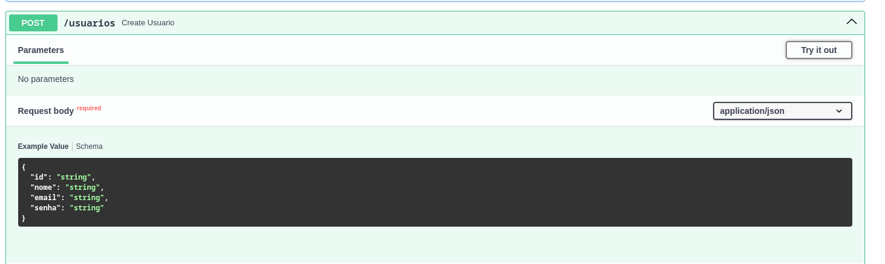
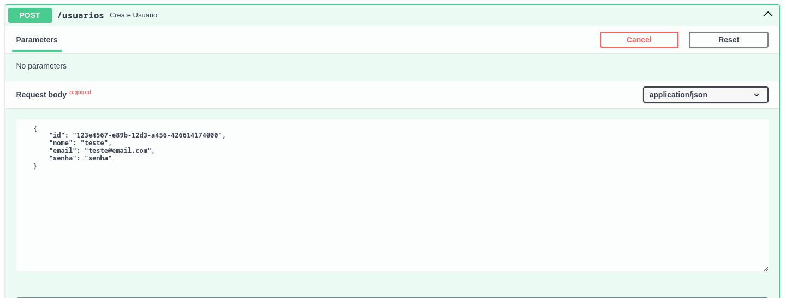
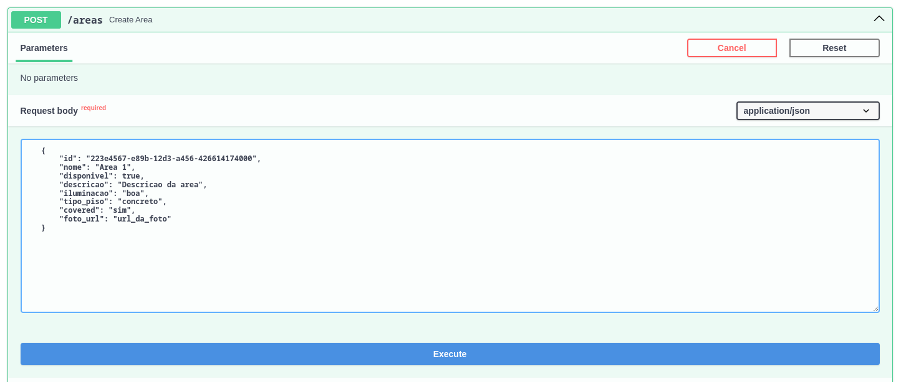
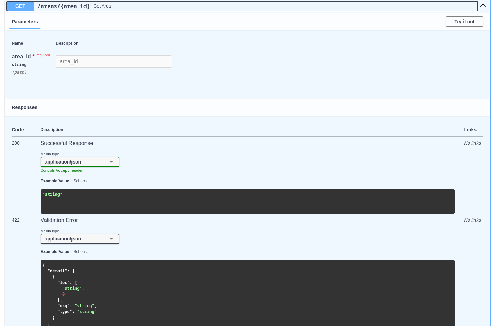
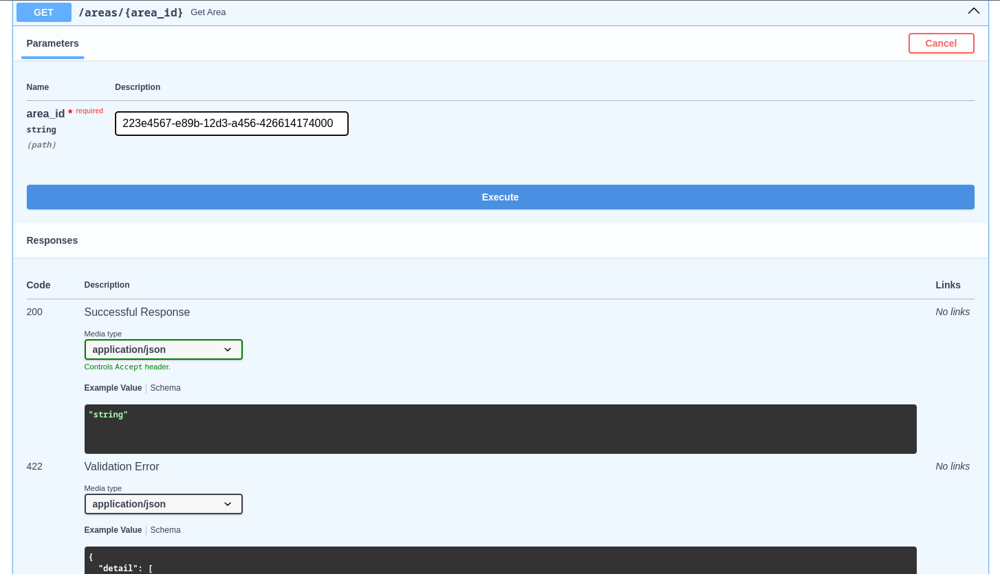
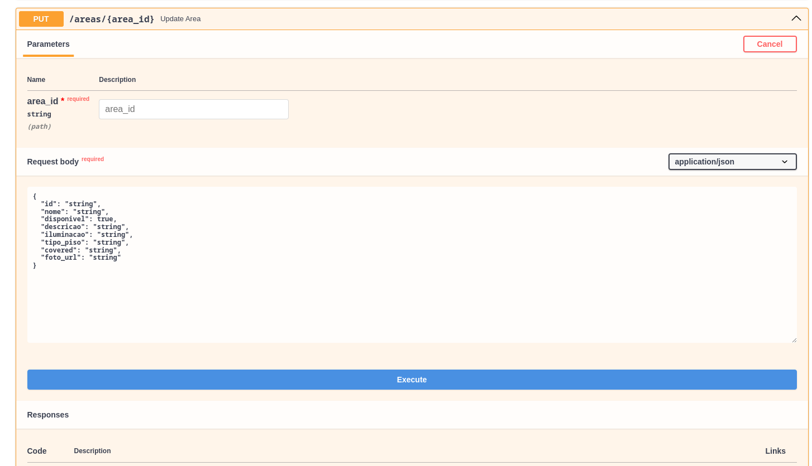

# Para subir a imagem do banco:

docker run -d -p 5439:5432 -e POSTGRES_USER=postgres -e POSTGRES_PASSWORD=postgres -e POSTGRES_DB=postgres postgres:latest

# para aplicar as migrações ja feitas no alembic:

```
  alembic upgrade head
```

# para criar uma nova migração no alembic:

```
  alembic revision --autogenerate -m "descrição_significativa"
```

Gera automaticamente uma nova revisão/migração baseada nas diferenças detectadas entre o estado atual do banco de dados e os modelos declarativos(model).

# Etapas para testar algumas rota usando o swegger do fastapi:

1. **Rota POST /usuarios para criar um usuário**:

   - Defina um usuario exemplo abaixo:
   - Authorize para as rotas protegidas no botão la em cima chamado de Authorize
   - clique em Try it out: 


   ```json
   {
       "id": "123e4567-e89b-12d3-a456-426614174000",
       "nome": "teste",
       "email": "teste@email.com",
       "senha": "senha"
   }
   ```
   - Execute: 


2. **Rota POST /areas para criar uma área**:

- criar uma area:

   ```json
   {
       "id": "223e4567-e89b-12d3-a456-426614174000",
       "nome": "Area 1",
       "disponivel": true,
       "descricao": "Descricao da area",
       "iluminacao": "boa",
       "tipo_piso": "concreto",
       "covered": "sim",
       "foto_url": "url_da_foto"
   }
   ```

4. **Rota GET /areas/{area_id} para obter uma área**:

   - Verificar area: 
   -  substituindo `{area_id}` pelo ID da área que você criou: `223e4567-e89b-12d3-a456-426614174000`
   - execute: 

5. **Rota PUT /areas/{area_id} para atualizar uma área**:

   - Atualize uma area.
   - substituindo `{area_id}` pelo ID da área que você criou: `223e4567-e89b-12d3-a456-426614174000` 
   -insira o corpo da solicitação com os novos valores para a área.

6. **Rota DELETE /areas/{area_id} para deletar uma área**:

   - DELETE.
   - Substituindo `{area_id}` pelo ID da área que você criou: `223e4567-e89b-12d3-a456-426614174000`
   - execute os comandos de try é execute....

7. **Rota POST /reservas para criar uma reserva**:

   - POST.
   - insira o corpo da solicitação. Por exemplo:

   ```json
   {
       "id": "323e4567-e89b-12d3-a456-426614174000",
       "valor": 100,
       "reserva_data": "2023-12-01T00:00:00Z",
       "hora_inicio": "2023-12-01T08:00:00Z",
       "hora_fim": "2023-12-01T10:00:00Z",
       "justificacao": "Justificativa da reserva",
       "reserva_tipo": "Tipo da reserva",
       "status": "Ativa",
       "disponivel": true,
       "area_id": "223e4567-e89b-12d3-a456-426614174000",
       "usuario_id": "123e4567-e89b-12d3-a456-426614174000"
   }
   ```

8. **Rota GET /reservas/{reservation_id} para obter uma reserva**:

   - Defina o método HTTP como GET.
   - Insira a URL, substituindo `{reservation_id}` pelo ID da reserva que você criou: `http://localhost:8000/reservas/323e4567-e89b-12d3-a456-426614174000`
   - Clique em "Send" para enviar a solicitação.
9. **Rota PUT /reservas/{reservation_id} para atualizar uma reserva**:

   - Defina o método HTTP como PUT.
   - Insira a URL, substituindo `{reservation_id}` pelo ID da reserva que você criou: `http://localhost:8000/reservas/323e4567-e89b-12d3-a456-426614174000`
   - Na guia "Headers", insira o cabeçalho de autorização. Key: `Authorization`, Value: `Bearer COLE_AQUI_SEU_TOKEN`
   - Na guia "Body", selecione "raw" e "JSON", e insira o corpo da solicitação com os novos valores para a reserva.
   - Clique em "Send" para enviar a solicitação.
10. **Rota DELETE /reservas/{reservation_id} para deletar uma reserva**:

    - Defina o método HTTP como DELETE.
    - Insira a URL, substituindo `{reservation_id}` pelo ID da reserva que você criou: `http://localhost:8000/reservas/323e4567-e89b-12d3-a456-426614174000`
    - Na guia "Headers", insira o cabeçalho de autorização. Key: `Authorization`, Value: `Bearer COLE_AQUI_SEU_TOKEN`
    - Clique em "Send" para enviar a solicitação.
